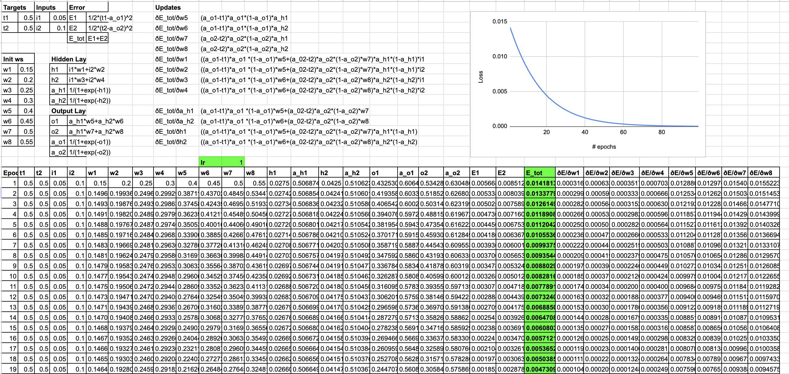
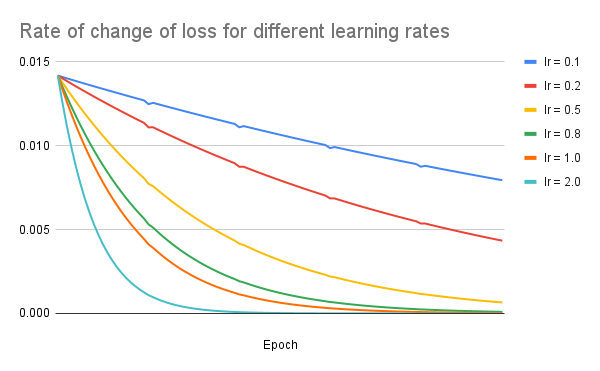

# Session 6 Assignment

## Part 1

### Important Steps

- The Excel file and the supporting screenshot describes the forward and backpropagation passes of a simple neural network with an input, hidden and output layer, each made up of 2 neurons.
- A single epoch consists of a forward pass and backpropagation
- #### Forward Pass
  1. Input layer neurons (i_1, i_2) store the input information
  2. Input neurons are multipled with corresponding weights (w_1, w_2, w_3, w_4) and linearly combined to get values of hidden layer neurons (h_1, h_2)
  3. Hidden layer neurons are passed through a non-linear sigmoid function to obtain hidden layer activations (a_h1, a_h2)
  4. Hidden layer activations are multiplied with corresponding weights ($w_5, w_6, w_7, w_8)$ and linearly combined to get values of output layer neurons (o_1, o_2)
  5. Output layer neurons are passed through a non-linear sigmoid function to obtain output layer activations (a_o1, a_o2)
  6. Output layer activations are compared with target values (t_1, t_2) via a Mean Squared Error (MSE) loss function to determine the loss (E_1, E_2), both of which are combined to give total loss of the epoch (E_tot)
- #### Backpropagation
  1.  Partial derivatives of E_tot is calculated wrt all parameters of the model
  2.  Chain rule is leveraged to calculate partial derivatives of E_tot wrt weights far away from it in the DAG (e.g. w1)
  3.  Sigmoid is differtiable for all values of x. Its derivative is used wherever activation is involved

### Learning Rate affects how loss evolves

- The graph above shows how loss evolves with epochs for different learning rates
- Low learning rates like 0.1 make our model underpowered for the data we have. In contrast, high learning rates make the network learn faster
  - Note: This should be confirmed with a separate test set. Training loss reaching low values in fewer epochs with high learning rates like 2.0 do not matter if test set loss is high
